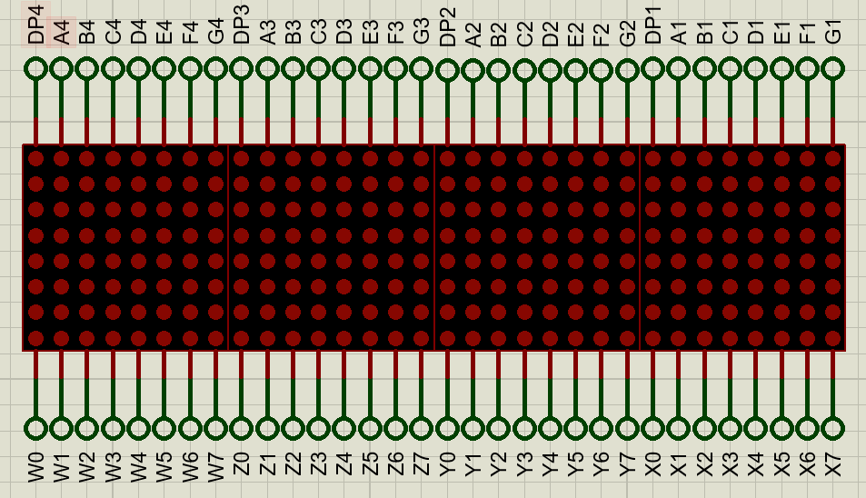
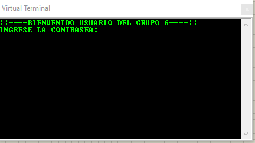
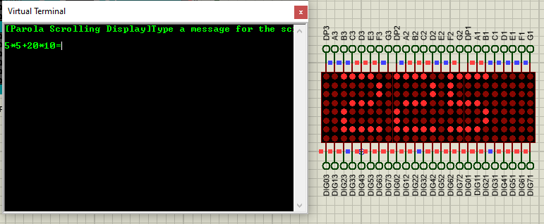

# <center> Manual Tecnico practica 1 </center>

## <center> ARQUITECTURA DE COMPUTADORES Y ENSAMBLADORES 1 </center>

## <center> Sección A </center>

---

```js
1. Dominic Juan Pablo Ruano Perez🧑‍💻
   - 202200075 🆔
2. River Anderson Ismalej Roman
   - 2021000096 🆔
3. Copiar esto y poner su info
   - carne 🆔
```

---

> **<center>Objetivos</center>**
>
>- General
>   -  Que el estudiante interactúe con el microcontrolador arduino 
>- Especificos
>   - Comprender el funcionamiento de las entradas y salidas, digitales y analogicas del microcontrolador Arduino.
>   - Aplicar los conocimientos del lenguaje C para estructuras de control en Arduino.
>   - Conocer las funciones básicas de la comunicación serial.
>   - Analizar y comprender la importancia de la simulación de sistemas.
>.

---

**<center>Introduccion</center>**

<div style='text-align: justify;'>

- Este manual técnico ofrece una exposición completa del sistema de seguridad y calculadora desarrollado mediante la plataforma Arduino. Este sistema representa una convergencia entre seguridad y funcionalidad, presentando una solución integral que garantiza tanto la protección como la capacidad de cálculo en un entorno determinado.

- La primera fase de este sistema se concentra en el establecimiento de un mecanismo de seguridad robusto. La autenticación se basa en una contraseña compuesta por caracteres alfanuméricos específicos, lo que garantiza un nivel de protección adecuado. Además, se han integrado medidas adicionales de seguridad, como la gestión de intentos fallidos y un protocolo de bloqueo temporal en respuesta a múltiples intentos incorrectos.

- La segunda etapa de este proyecto incorpora una funcionalidad de calculadora, proporcionando al usuario la capacidad de realizar operaciones matemáticas básicas. Este componente está diseñado para aceptar números enteros con signo y facilita la ejecución de operaciones de suma, resta, multiplicación y división mediante un teclado matricial.

</div>


---

**<center>Especificaciones del hardware</center>**

El sistema se basa en la plataforma Arduino y utiliza una serie de componentes específicos para su operación. A continuación, se detallan las especificaciones del hardware necesario:

> **<center>Plataforma Arduino</center>**
>Se requiere una placa Arduino compatible, Arduino Mega en este caso, para alojar y ejecutar el código del sistema. Esta placa actúa como el cerebro del sistema, coordinando todas las funciones y procesos.

> **<center>Matrices LED de 8x8</center>**
>Cuatro matrices LED de 8x8 se utilizan para la visualización las respuestas o códigos de error de cálculos matemáticos, en la calculadora. Estas matrices proporcionan una interfaz visual clara y son controladas directamente por el Arduino.

> **<center>Teclado Matricial</center>**
>Un teclado matricial se emplea como dispositivo de entrada para el sistema. Este teclado permite al usuario ingresar caracteres alfanuméricos y ejecutar comandos específicos, como cambiar la contraseña o validar una entrada.

> **<center>Switchs de Control</center>**
>Se utilizan switchs , como pulsadores, para activar funciones específicas del sistema, como el cambio entre el modo de seguridad y el modo de calculadora, así como el bloqueo del sistema.

> **<center>Componentes de Visualización</center>**
>Además de las matrices LED, se emplean LEDs individuales para indicar el estado del sistema, como la validación de la contraseña o el bloqueo temporal tras múltiples intentos fallidos.

> **<center>Potenciómetro</center>**
> Un potenciómetro se utiliza para controlar la velocidad de desplazamiento de los mensajes en las matrices LED durante la operación en el modo de visualización.

*Es esencial asegurarse de contar con todos estos componentes y de seguir las conexiones adecuadas según las especificaciones del sistema para garantizar un funcionamiento óptimo y seguro del sistema de seguridad y calculadora implementado.*

---

> **<center>Estructura del Sistema</center>**
> 
>
> *<center>Imagen del circuito completo <center>*
>.

---

>**<center>Funcionamiento del Sistema</center>**
>
>*<center>Funcionamiento del Sistema</center>*
>(aquí explicar tanto las conexiones en proteus como el codigo)
> 
> ---
>
>*<center>Calculadora</center>*
>El sistema de control de matrices LED 8x8 utiliza la librería Parola para interactuar con cuatro matrices LED utilizando el chip controlador MAX7219
>
> - **Implementa:**
>   - Control de cuatro matrices LED 8x8 utilizando MAX7219.
>   - Soporte para mostrar texto y sus animaciones.
>   - Personalización de velocidad, dirección y efectos de desplazamiento.
>   - Facilidad de integración con microcontroladores compatibles con Arduino.
>> #### Chip controlador MAX7219
>> Utiliza una técnica de multiplexado para controlar múltiples LED utilizando un número mínimo de pines de salida del microcontrolador, Se comunica con el microcontrolador a través de una interfaz en serie, lo que facilita su integración con una amplia gama de microcontroladores como Arduino.
>> - 
>
>> #### Matriz 8x8
>> Una matriz LED 8x8 es un arreglo de 64 diodos emisores de luz (LEDs) dispuestos en una matriz de 8 filas y 8 columnas. Cada LED puede iluminarse individualmente, lo que permite mostrar patrones, texto con animaciones, Dado que los microcontroladores generalmente tienen un número limitado de pines de salida, se utiliza una técnica llamada multiplexación para controlar múltiples LEDs con un número mínimo de pines. Esto implica encender y apagar rápidamente diferentes combinaciones de filas y columnas para crear la ilusión de que todos los LEDs se están controlando simultáneamente.
>> - 
>
>> #### Codigo
>> En esta parte se mostraran las funciones, objetos y variables declaradas que se emplearon para poder mostrar los resultados en las matrices led.
>> ``` c++
>> //Declaracion 
>> #include <MD_Parola.h>
>> #include <MD_MAX72xx.h>
>> #define HARDWARE_TYPE MD_MAX72XX::FC16_HW
>> #define MAX_DEV 4
>> #define DATA 10
>> #define CS 9
>> #define CLK 8
>> 
>> // variables
>> String mensaje = ":v";
>> int velocidad = map(200, 1023, 0, 400, 15);
>> int valorBinarioSW1 = digitalRead(13);
>> int valorBinarioSW2 = digitalRead(12);
>> MD_Parola MATRICES = MD_Parola(HARDWARE_TYPE, DATA, CLK,  CS, MAX_DEV);
>> int valor = 1;
>>
>> //Funcion que recibe un String y muestra el texto en las matrices.
>> void PrintInMatrix(String mensaje);
>> ```
> La funcion PrintInMatrix implementa un bucle por el cual se imprime o muestra en las matrices el string que se le envio por parametro y retorna void al detectar que se termino de mostrar el texto.
>
> ---
>---
>*<center>Impresión en Matrices</center>*
>>La impresion LED en matrices se logra mediante el control preciso de una serie de LEDS, dipuestos en una matriz. En esta practica usamos como libreria MD_Parola y MD_MAX72xx para manejar la impresion en una matriz de LEDS.

<div div style='text-align: center;'>

</div>

>#####Inicializacion de la matriz LEDS:
>Se define el hadware y se inicaliza la matriz de LEDS, con la funcion MD_Parolay MD_MAX72xx. Se especifican los pines para el reloj(CLK_PIN), datos(DATA_PIN) y de chip (CS_PIN).

```Codigo:
>MD_Parola P = MD_Parola(HARDWARE_TYPE, CS_PIN, MAX_DEVICES);
```
>#####Definicion de la animacion y velocidad de desplazamiento:
>Se definen los parametros de velocidad para el desplazamiento del resultado (scrollSpeed), el efecto de desplazamiento (scrollSpeed)la pausa del desplazamiento y la alinación del texto.

```Codigo:
>uint8_t scrollSpeed = 100;    
textEffect_t scrollEffect = PA_SCROLL_LEFT;
textPosition_t scrollAlign = PA_LEFT;
uint16_t scrollPause = 0;
```
>#####Lectura de la entrada serial:
>Se lee la entrada serial para recibir mensaje que se mostrarán en la matriz de LEDS.

```Codigo:
>void readSerial(void)
{
  static char *cp = newMessage;

  while (Serial.available())
  {
    *cp = (char)Serial.read();
    if ((*cp == '\n') || (cp - newMessage >= BUF_SIZE-2)) 
    {
      *cp = '\0';
      cp = newMessage;
      newMessageAvailable = true;
    }
    else 
      cp++;
  }
}
```
<div div style='text-align: center;'>

</div>

>#####Manejo de le entrada del teclado:
>Se utiliza la biblioteca Keypad para leer los datos de un teclado matricial 4*4. Se construye una expresion matematica a partir de la entrada del teclado y se evalúa para mostrar el resultado en la matriz LEDS.

```Codigo:
>void readKeypad(void){
  if (millis() - resultDisplayTime < 30000) {
    return;
  }

  char key = keypad.getKey();
  if (key){
    Serial.print(key);
    switch(key) {
      case '0'...'9':
        expr += key;
        break;
      case '+':
      case '-':
      case '*':
      case '/':
        expr += String(" ") + key + String(" ");
        break;
      case '=':
        error = false;
        int result = evaluateExpression(expr);
        expr = "";
        if (!error) {
          String resultString = "RESULTADO = " + String(result);
          resultString.toCharArray(newMessage, BUF_SIZE);
        }
        newMessageAvailable = true;
        resultDisplayTime = millis();
        break;
      case 'C':
        expr = "";
        P.displayClear();
        newMessage[0] = '\0'; 
        newMessageAvailable = false; 
        break;
    }
  }
}
```
<div div style='text-align: center;'>

</div>

>#####Actualizacion de la matriz LEDS:
>En nuestro bucle principal loop se actualiza continuamente la animación de la matriz de LEDS, y se procesan la nuevas entradas de mensajes y teclado para poder mostrarlas en la matriz.

```Codigo:
>void loop()
{
  #if USE_UI_CONTROL
    doUI();
  #endif 
  if (P.displayAnimate())
  {
    P.displayReset();
    if (newMessageAvailable)
    {
      strcpy(curMessage, newMessage);
      newMessageAvailable = false;
      P.displayText(curMessage, scrollAlign, scrollSpeed, scrollPause, scrollEffect, scrollEffect);
    }
  }
}
```
> ---
>
>*<center>Impresión en consola</center>*
>(aquí explicar tanto las conexiones en proteus como el codigo)


---

###**<center>Apéndices</center>**
- <a href="https://github.com/DominicRuano/ACYE1_A_1S24_G3/blob/main/Practica1_code/Practica1_code.ino" target="_blank">Link del codigo Arduino</a>
- <a href="https://github.com/DominicRuano/ACYE1_A_1S24_G3/blob/main/Practica_1.pdsprj" target="_blank">Link del archivo en proteus</a>

